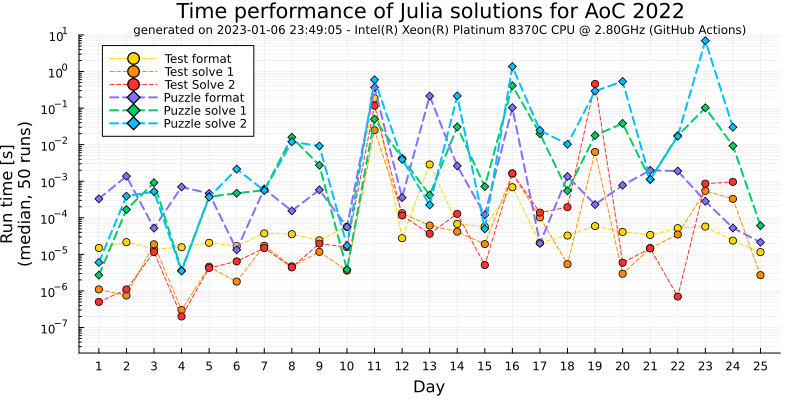

# Julia-AoC-2022 🎄 [Advent of Code 2022](https://adventofcode.com/2022)
Examples of Julia solutions for the Advent of Code 2022 edition. 
Using this project to familiarize myself with Julia

## Performance

<picture>
  <source media="(prefers-color-scheme: dark)" srcset="./figs/time_performance_dark.svg">
  <source media="(prefers-color-scheme: light)" srcset="./figs/time_performance_light.svg">
  
</picture>
